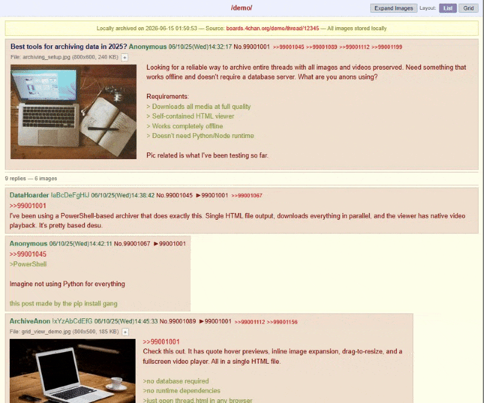

# 4chan Thread Archiver

> Download entire 4chan threads — every image, every video, full quality. Generates a single self-contained HTML viewer with authentic 4chan styling that works completely offline.

<p align="center">
  
  
  
  
</p>

<p align="center">
  
</p>

**Get started:**

```
archive.bat https://boards.4chan.org/g/thread/12345678
```

### Why this tool?

Most 4chan archiver scripts dump files in a folder with zero post context. This tool downloads all media in parallel and generates a single HTML file with authentic Yotsuba B styling, quote hover previews, inline expansion, grid layout, and native video playback — all fully offline.

### Features

- **Full quality images & videos** — downloads original attachments at full quality without compression
- **Offline HTML viewer** — single file opens in any browser, works completely offline under `file://` protocol
- **Parallel downloads** — concurrent file downloads with configurable limits (defaults to 4, supports 1-16)
- **Native video player** — WebM and MP4 rendered with HTML5 video player, playback controls, autoplay, loop, and auto-mute
- **Expand / collapse images** — dedicated toggle to expand or collapse all static image attachments inline
- **Drag-to-resize** — expanded images and video players can be resized via mouse dragging with aspect ratio preservation
- **Quote hover previews** — hover over `>>quotelinks` to see a floating preview of the referenced post
- **Dynamic backlinks** — auto-generated quote backlinks with scroll-to-highlight navigation
- **Authentic Yotsuba B styling** — beige post boxes, green tripcodes, greentext, capcodes, post headers
- **List / Grid toggle** — switch between authentic single-column and responsive card grid layouts
- **Idempotent downloads** — automatically skips already-downloaded files for fast, efficient updates
- **Error resilience** — exponential backoff retries, connection timeouts, and dynamic API rate limiting

---

## Requirements

- Windows with PowerShell 5.1+ (included in Windows 10/11)

## Quick Start

### Single thread

```
archive.bat https://boards.4chan.org/g/thread/12345678
```

### Interactive mode (paste multiple URLs)

```
archive-interactive.bat
```

Or run the PowerShell script directly:

```powershell
.\archive-interactive.ps1
```

### PowerShell directly

```powershell
.\archive.ps1 "https://boards.4chan.org/g/thread/12345678"
```

### List archived threads

```
list-archives.bat
```

### Refresh UI on all archives

If you update the tool and want existing archives to use the latest HTML/template:

```
update-html.bat
```

Or refresh a single archive:

```powershell
.\update-html.ps1 -ArchiveName "g_12345678"
```

This regenerates `thread.html` from the saved `thread.json` without re-downloading anything. Useful for threads that are no longer available online.

### Auto-update all live threads

Fetch fresh data from 4chan for every archive, download new posts/images, and regenerate HTML:

```
update-all.bat
```

- Threads that are still alive get new posts downloaded
- Threads that have been removed (404) are marked as REMOVED but their local files are preserved
- Threads with no changes are skipped
- Rate limited to respect 4chan API rules

## Supported URL formats

All of these work:

```
https://boards.4chan.org/g/thread/12345678
https://boards.4channel.org/a/thread/12345678
https://4chan.org/g/thread/12345678
https://a.4cdn.org/g/thread/12345678.json
```

## Options

| Parameter | Default | Description |
|-----------|---------|-------------|
| `Url` | *(required)* | Thread URL to archive |
| `-Concurrency` | `4` | Number of parallel downloads (1-16) |
| `-DelayMs` | `0` | Delay between file downloads in milliseconds (0-10000) to prevent rate limiting |

Example with custom parallelism and rate-limiting delay:

```powershell
.\archive.ps1 "https://boards.4chan.org/g/thread/12345678" -Concurrency 4 -DelayMs 250
```

## Output structure

```
archives/
  g_12345678_mechanical_keyboards/
    thread.html          <- open this in a browser
    thread.json          <- cached API response for efficient updates
    images/
      1234567890123.jpg  <- full quality image
      1234567890123s.jpg <- thumbnail
      ...
```

The `thread.html` file is fully self-contained. It references images from the local `images/` folder, so it works completely offline with no internet connection needed.

## Updating archives

If a thread is already archived, the tool will ask whether to update:

```
Thread already archived at: archives/g_12345678
Update with new posts? (Y/n)
```

Press Enter (or `y`) to fetch new posts. Only images from new posts are downloaded -- existing images are never re-downloaded. The HTML is regenerated with all posts.

The cached `thread.json` is used to detect which posts are new, making updates fast even for large threads.

## Notes

- Respects 4chan API rate limits via parallel connection cap
- Deleted threads or 404s will show an error and clean up the folder (new archives only; existing archives are preserved on update failure)
- Thumbnails are downloaded alongside full images for fast browsing
